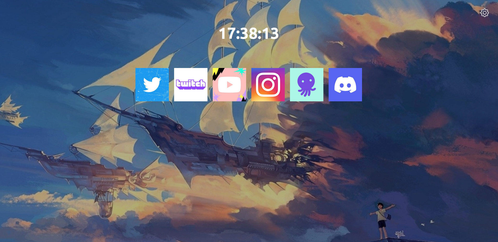

## Tabstart

Tabstart is a new tab replacement page. At the moment it displays a random image from Reddit and a list of most visited sites by the user.



[CHANGELOG](./CHANGELOG.md)

## Installation from source

First run:

```
npm install
```

Then run

```
npm run build
```

## Debug in firefox

Go to manage extensions and then click on the gear icon > debug extensions > load temporary extension.

Now select the manifest file inside the public folder.

## Debug in chrome

Go to Settings > Load unpacked.

Now select the public folder of the project.

